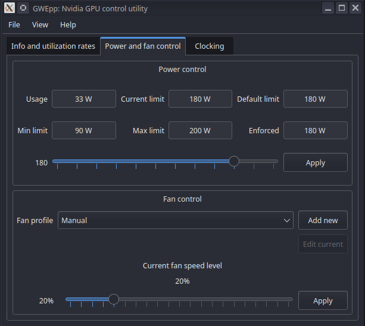

# GWEpp
GreenWithEnvy re-implementation using only C, C++ and Qt
no other shit such as python

no other shit such as python

## UI preview




## Building from sources
```
$ git clone --recurse-submodules https://codeberg.org/AlexCr4ckPentest/GWEpp
$ cd GWEpp
$ mkdir build && cd build
$ cmake .. -DCMAKE_BUILD_TYPE=Debug
$ make -j$(nproc)
```
