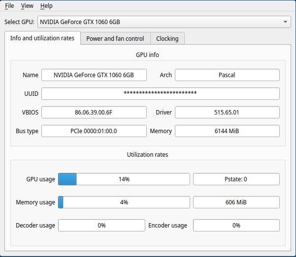

# NvCtrl-Linux (previous GWEpp)
Simple and lightweight utility for control Nvida GPU on GNU/Linux

* Written in C++ and Qt for performance and lightweight
* No other extra dependencies such as Python and XNvCtrlLib (works in Wayland)



## Installation
* Download source code of [latest release](https://codeberg.org/AlexCr4ckPentest/NvCtrl-linux/releases/latest)

### Building from sources
```
$ git clone --recurse-submodules https://codeberg.org/AlexCr4ckPentest/NvCtrl-linux
$ cd NvCtrl-linux
$ mkdir build && cd build
$ cmake ..
$ make -j$(nproc)
```
